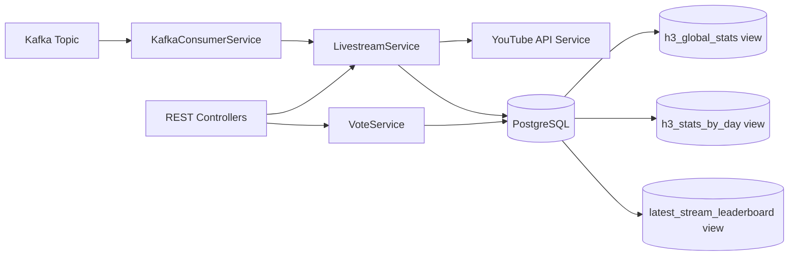

# h3-late-yt-stats-service

Backend service for ingesting YouTube livestream events, tracking lateness and duration metrics, collecting user votes, and serving leaderboard/statistics APIs.

## What This Service Does

This service is responsible for:

- Consuming YouTube-related events from Kafka.
- Fetching video metadata from the YouTube Data API.
- Persisting livestream lifecycle data (scheduled, live, ended, cancelled).
- Computing lateness and total duration fields.
- Providing search, stats, and leaderboard APIs.
- Accepting user votes (guesses) for scheduled streams.
- Supporting manual/batch re-processing of videos via REST.

## Tech Stack

- Java 25
- Spring Boot 4
- Spring Web
- Spring Data JPA
- PostgreSQL (runtime)
- Kafka consumer (Spring Kafka)
- Bucket4j rate limiting
- Lombok
- JUnit + Mockito + H2 (tests)

## High-Level Architecture



## Request and Data Flows

### 1) Kafka-driven livestream updates

1. The h3-late-yt-ingestion-service publishes a kafka message, consumed by this service, where key = videoId and value = VideoEventDto.
2. Kafka listener delegates to LivestreamService.processLivestreamEvent(videoId, messageBody).
3. Service calls YouTube API for snippet/status/liveStreamingDetails.
4. Service creates or updates Livestream row.
5. Late/on-time/early and duration calculations are applied when timestamps are available.
6. If Kafka message body is null, existing stream is marked CANCELLED.

### 2) Manual batch processing endpoint

1. Client calls POST /api/livestream/process/{videoIds}.
2. Controller splits comma-separated IDs.
3. Service processes each ID by calling YouTube API.
4. Returns per-ID results and success/failure counts.

Behavior flag:

- bypassCheck=false (default): skips creation when uploadStatus is "processed" and the video does not yet exist in DB.
- bypassCheck=true: bypasses that skip rule.

### 3) Voting and leaderboard flow

1. Client posts a vote for a stream.
2. VoteService validates:
   - livestream exists
   - livestream status is SCHEDULED
   - username has not already voted for that video
3. Vote is persisted.
4. Leaderboard endpoint reads from latest_stream_leaderboard view.

## Domain Model

### Livestream

Primary table: livestream

Key fields:

- videoId (PK)
- title
- scheduledStart
- actualStart
- actualEnd
- diffSeconds (actualStart - scheduledStart)
- totalDurationSeconds (actualEnd - actualStart)
- status: SCHEDULED | LIVE | ENDED | CANCELLED
- timeStatus: LATE | ON_TIME | EARLY | CANCELLED
- createdAt

### Vote

Primary table: vote

- id (PK)
- videoId
- userName
- diffSeconds (user guess)
- createdAt

### LeaderboardEntry

Read-only entity mapped to DB view: latest_stream_leaderboard

- userName
- userGuess
- actualResult
- proximityScore

## Lateness and Duration Rules

When actualStart appears:

- diffSeconds = actualStart - scheduledStart
- if diffSeconds > 10 => LATE
- if diffSeconds < 0 => EARLY
- otherwise => ON_TIME

When actualEnd appears:

- totalDurationSeconds = actualEnd - actualStart
- stream status => ENDED

## API Surface

Base URL: http://localhost:8081

### Livestream APIs

- GET /api/livestream/{id}
  - Get one livestream by videoId.

- GET /api/livestream
  - Search/filter livestreams.
  - Query params:
    - status (optional)
    - timeStatus (optional)
    - search (optional, matches title/videoId)
    - pageable params: page, size, sort

- GET /api/livestream/stats
  - Returns global aggregate metrics from h3_global_stats.

- GET /api/livestream/stats/day
  - Returns day-based metrics from h3_stats_by_day.

- POST /api/livestream/process/{videoIds}?bypassCheck=false
  - videoIds is a comma-separated path segment.
  - Example: /api/livestream/process/abc123,def456
  - Response includes totalRequested, successCount, failureCount, and per-ID results.

### Vote APIs

- POST /api/vote/{videoId}
  - Body example:

```json
{
  "userName": "alice",
  "diffSeconds": 42
}
```

- GET /api/vote/leaderboard/latest
  - Optional query param: search
  - Supports pageable params

## Rate Limiting

A global API filter applies to all paths starting with /api/.

Current limits (per client IP):

- 100 requests/minute
- 20 requests/second burst

Headers:

- X-Rate-Limit-Remaining
- X-Rate-Limit-Retry-After-Seconds (when throttled)

## CORS

Default allowed origin patterns:

- https://*.h3late.com
- https://h3late.com

Override with:

- cors.allowed-origins=comma,separated,origins

## Configuration

Application settings are environment-variable driven.

Required/important variables:

- DB_URL
- DB_USER
- DB_PASSWORD
- KAFKA_HOST
- KAFKA_GROUP_ID
- KAFKA_TOPIC
- KAFKA_API_KEY
- KAFKA_API_SECRET
- YOUTUBE_API_KEY

Other:

- server.port defaults to 8081

## Local Development

### Prerequisites

- JDK 25
- Maven (or use ./mvnw)
- PostgreSQL
- Kafka access (or local broker)
- YouTube Data API key

### Option A: Run locally with Maven

1. Set environment variables.
2. Start the app:

```bash
./mvnw spring-boot:run
```

(Windows PowerShell)

```powershell
.\mvnw.cmd spring-boot:run
```

### Option B: Run with Docker Compose

1. Ensure Docker network exists (compose expects external network named youtube-shared-network):

```bash
docker network create youtube-shared-network
```

2. Set/override env vars as needed.
3. Start:

```bash
docker compose up --build
```

Service ports:

- API: 8081
- Postgres: 5432

## Database Notes

This service expects DB views used by repository projections:

- h3_global_stats
- h3_stats_by_day
- latest_stream_leaderboard

Important: Hibernate auto-ddl is update, which manages tables but does not create these custom views automatically. Ensure they exist in your database.

## Testing

Run tests:

```bash
./mvnw test
```

(Windows PowerShell)

```powershell
.\mvnw.cmd test
```

Test profile uses in-memory H2 (src/test/resources/application.yml).

## Project Layout

```text
src/main/java/com/h3late/stats/
  config/        # CORS and rate-limiting configuration
  controller/    # REST controllers
  dto/           # API and external integration DTOs + projections
  entity/        # JPA entities and enums
  filter/        # HTTP rate-limiting filter
  repository/    # Spring Data repositories
  service/       # Business logic + YouTube/Kafka integration

src/main/resources/
  application.yaml

src/test/
  java/...       # unit tests
  resources/     # test config
```

## Operational Notes and Pitfalls

- Kafka null message body path marks stream as CANCELLED.
- Manual processing endpoint always fetches fresh details from YouTube API.
- For manual processing, bypassCheck should be used carefully; enabling it can create entries for videos normally filtered out.
- Voting is intentionally restricted to SCHEDULED streams only.
- Leaderboard and stats depend on DB views, not direct table aggregation inside Java.


## Quick Curl Examples

Get livestream by id:

```bash
curl http://localhost:8081/api/livestream/VIDEO_ID
```

Search livestreams:

```bash
curl "http://localhost:8081/api/livestream?status=LIVE&timeStatus=ON_TIME&search=show&page=0&size=20"
```

Manual batch process:

```bash
curl -X POST "http://localhost:8081/api/livestream/process/vid1,vid2,vid3?bypassCheck=true"
```

Cast vote:

```bash
curl -X POST http://localhost:8081/api/vote/VIDEO_ID \
  -H "Content-Type: application/json" \
  -d '{"userName":"alice","diffSeconds":30}'
```

Get leaderboard:

```bash
curl "http://localhost:8081/api/vote/leaderboard/latest?search=ali&page=0&size=10"
```

## Where to Start as a New Developer

If you are onboarding, read in this order:

1. application.yaml for environment and integration settings.
2. controllers to understand API contracts.
3. LivestreamService for core business rules.
4. repositories and DB views for aggregate/leaderboard behavior.
5. tests to see expected behavior.

This sequence gives you the fastest path to productive changes.
